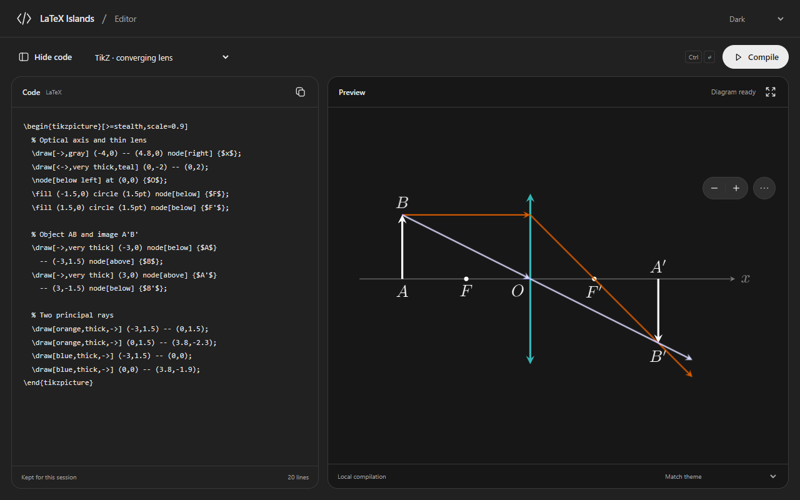
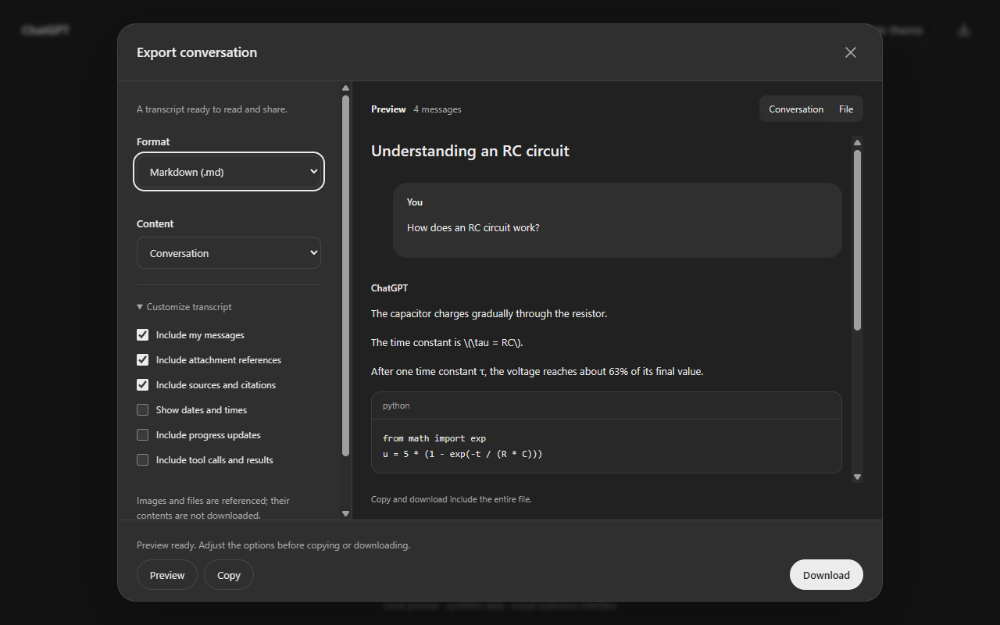

# LaTeX Islands

**Local TikZ diagrams and readable conversation exports for ChatGPT.**

LaTeX Islands turns supported LaTeX code blocks in ChatGPT replies into interactive diagrams. The TeX compiler, packages and fonts run locally in your browser.

## Features

- TikZ, Circuitikz, PGFPlots, tikz-cd, Chemfig and TikZ-3DPlot support through a bundled WebAssembly TeX engine.
- An integrated preview with zoom, drag, fit, fullscreen editing and PNG/SVG downloads.
- Early detection while ChatGPT streams a reply, with prewarming and cached compilations.
- A standalone editor with examples and a monochrome interface. Follow ChatGPT's last observed theme, follow the system, or choose light/dark.
- Theme-adapted diagram colors or original LaTeX colors on a white background, including exports.
- Conversation export as Markdown, plain text or a complete JSON archive, with presets, individual content options and a Dialogue/File preview.

The conversation exporter requests the current conversation's JSON pages from ChatGPT using your existing session. It preserves code and TeX in the transcript, removes technical clutter by default, and keeps the original API pages in JSON. Attachments are references, not embedded files. The export preview displays equations as TeX source.





## Install

### Chrome desktop

1. Download the Chrome ZIP from [Releases](https://github.com/Fefedu973/latex-islands/releases/latest).
2. Extract the ZIP into a permanent folder.
3. Open `chrome://extensions`, enable **Developer mode**, and select **Load unpacked**.
4. Select the folder containing `manifest.json` directly, then reload your ChatGPT tabs.

Requires Chrome 116 or newer.

### Firefox desktop

For development, build the Firefox package, open `about:debugging#/runtime/this-firefox`, choose **Load Temporary Add-on**, and select `dist/firefox/manifest.json`. Temporary installations are removed when Firefox closes. Requires Firefox 140 or newer.

See the [user guide](USER-GUIDE.md), [export guide](EXPORT.md), and [validation status](VALIDATION.md).

## Develop and build

Use Node.js 22 or newer and npm. No TeX installation is required to run the extension or its bundled engine tests.

```sh
npm ci
npm test
npm run test:engine
npm run build
```

The build produces `dist/chrome/`, `dist/firefox/`, browser-specific ZIPs and a corresponding source ZIP. Extension source files are shipped directly; there is no remote compilation service or runtime dependency installation.

For Firefox validation, run `npm run lint:firefox` after building. See [CONTRIBUTING.md](CONTRIBUTING.md) and [reviewer build notes](docs/reviewer-build.md) for package contents and the bundled TeX runtime's provenance and reproduction limits.

## Privacy

Diagram compilation stays on your device. There is no analytics, developer backend or advertising. Conversation export makes authenticated, same-origin requests to ChatGPT only after an export action. It does not upload the conversation to the developer. Preferences and the standalone editor's last source are saved locally; downloaded files and clipboard contents are controlled by you. Details: [PRIVACY.md](PRIVACY.md).

## Limits

This is a diagram renderer, not a complete TeX Live installation. External files, missing packages, shell commands, BibTeX and document pagination are outside its scope. Complex plots can take several seconds. ChatGPT's DOM and internal conversation API may change. JSON export preserves what the server returns; it cannot recover unreturned branches or attachment binaries.

## Project and license

[GitHub: Fefedu973/latex-islands](https://github.com/Fefedu973/latex-islands). Community contributions are welcome.

The extension code is licensed under [GPL-3.0-or-later](LICENSE). Bundled components retain their own licenses; see [THIRD_PARTY_NOTICES.md](THIRD_PARTY_NOTICES.md). LaTeX Islands is an independent project, not affiliated with or endorsed by OpenAI, Google or Mozilla.
