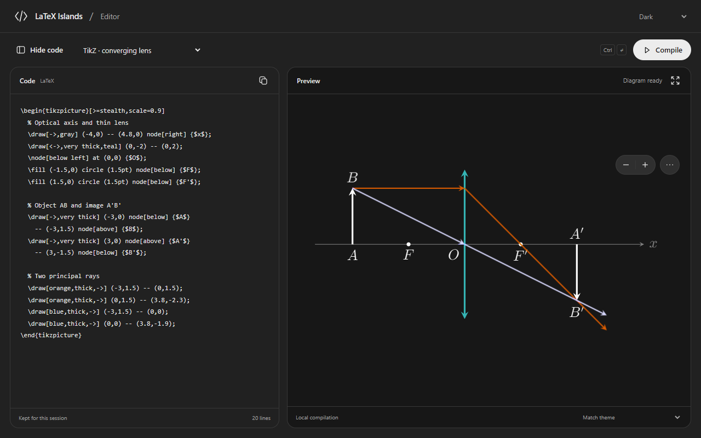
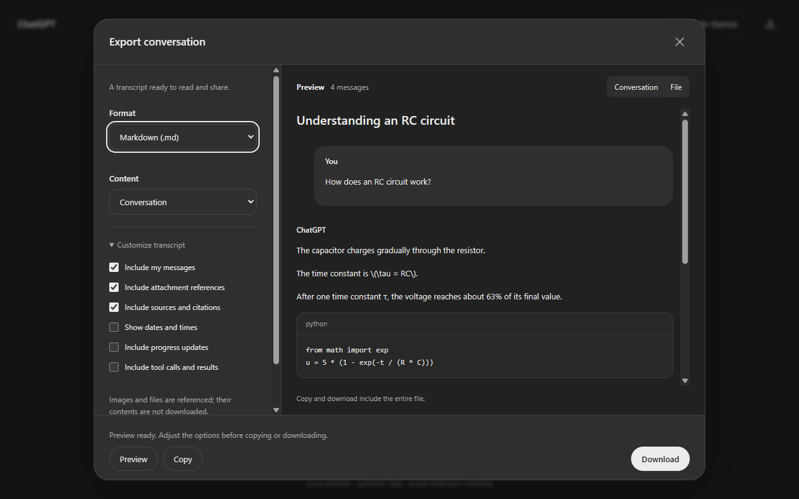

# LaTeX Islands

**Local TikZ diagrams and readable conversation exports for ChatGPT.**

LaTeX Islands turns supported LaTeX code blocks in ChatGPT replies into interactive diagrams. The TeX compiler, packages and fonts run locally in your browser.

## Features

- TikZ, Circuitikz, PGFPlots, tikz-cd, Chemfig and TikZ-3DPlot support through a bundled WebAssembly TeX engine.
- Automatic dependencies for common mathematical labels, scientific units and chemical formulae, with support for Unicode math characters. See [renderer support](docs/renderer-support.md).
- An integrated preview with zoom, drag, fit, fullscreen editing and PNG/SVG downloads.
- Early detection while ChatGPT streams a reply, with prewarming and cached compilations.
- A standalone editor with examples and a monochrome interface. Follow ChatGPT's last observed theme, follow the system, or choose light/dark.
- Theme-adapted diagram colors or original LaTeX colors on a white background, including exports.
- Conversation export as Markdown, plain text or a complete JSON archive, with presets, individual content options and a Conversation/File preview.
- Rich PDF export with rendered equations, tables, images and complete vector diagrams fitted to the page. The extension scrolls the conversation to load earlier messages before capturing them.
- Select individual messages, export answers or prompts only, or save one reply with its optional preceding prompt. Check the result in the export preview before saving.

Markdown, text and JSON exports request the current conversation's JSON pages from ChatGPT using your existing session. Markdown and text preserve code and TeX, apply your message selection and remove technical clutter by default. Their preview displays equations as TeX source. The complete JSON archive retains the original API pages without filtering. PDF captures ChatGPT's rendered page, including messages loaded by automatic scrolling, without requesting the conversation API itself. Preview the selected content, then use the browser's print dialog to save it as PDF. Attachment files are not downloaded.





## Install

### Chrome desktop

Install from the [Chrome Web Store](https://chromewebstore.google.com/detail/pnmeipidjjoknchljkpkpeodmlhlnnjj) for automatic updates after store approval. Requires Chrome 116 or newer.

For development or to test a GitHub release before store approval:

1. Download the Chrome ZIP from [Releases](https://github.com/Fefedu973/latex-islands/releases/latest).
2. Extract the ZIP into a permanent folder.
3. Open `chrome://extensions`, enable **Developer mode**, and select **Load unpacked**.
4. Select the folder containing `manifest.json` directly, then reload your ChatGPT tabs.

To update an unpacked installation, replace its files with the latest Chrome ZIP, click **Reload** on the extension's card at `chrome://extensions`, then reload your ChatGPT tabs. The version number on the extension card identifies the installed package.

### Firefox desktop

Install from [Firefox Add-ons](https://addons.mozilla.org/firefox/addon/latex-islands/) for signed releases and automatic updates after store approval.

For development, build the Firefox package, open `about:debugging#/runtime/this-firefox`, choose **Load Temporary Add-on**, and select `dist/firefox/manifest.json`. Temporary installations are removed when Firefox closes. Requires Firefox 140 or newer.

See the [user guide](USER-GUIDE.md), [export guide](EXPORT.md), and [validation status](VALIDATION.md).

## Suggested custom instructions

You can add the following to your ChatGPT custom instructions to encourage diagram responses that work with the extension:

> When I ask for a schematic, diagram, electrical circuit, scientific plot, mathematical graph, 2D/3D representation or molecule, and TikZ is suitable, generate it directly in a fenced Markdown block labeled `tikz` so my extension can render it inline. Use Circuitikz, PGFPlots, Chemfig, tikz-3dplot, tikz-cd or the appropriate TikZ libraries as needed. Prefer Mermaid for simple diagrams where Mermaid is a better fit. Do not generate a complete LaTeX document or PDF unless I explicitly ask for one.

## Develop and build

Use Node.js 22 or newer and npm. No TeX installation is required to run the extension or its bundled engine tests.

```sh
npm ci
npm test
npm run test:engine
npm run build
```

The build produces `dist/chrome/`, `dist/firefox/`, browser-specific ZIPs and a corresponding source ZIP. Extension source files are shipped directly; there is no remote compilation service or runtime dependency installation.

For Firefox validation, run `npm run lint:firefox` after building. See [CONTRIBUTING.md](CONTRIBUTING.md) and [reviewer build notes](docs/reviewer-build.md) for package contents and the bundled TeX runtime's provenance and reproduction limits.

Pushing a matching version tag publishes a GitHub release after CI validation. See [releasing](docs/releasing.md) for the workflow and future Chrome Web Store/Firefox publishing setup.

## Privacy

Diagram compilation stays on your device. There is no analytics, developer backend or advertising. Conversation export makes authenticated, same-origin requests to ChatGPT only after an export action. It does not upload the conversation to the developer. Preferences and the standalone editor's last source are saved locally; downloaded files and clipboard contents are controlled by you. Details: [PRIVACY.md](PRIVACY.md).

## Limits

This is a diagram renderer, not a complete TeX Live installation. External files, missing packages, shell commands, BibTeX and document pagination are outside its scope. Complex plots can take several seconds. ChatGPT's DOM and internal conversation API may change. JSON export preserves what the server returns; it cannot recover unreturned branches or attachment binaries.

## Project and license

[GitHub: Fefedu973/latex-islands](https://github.com/Fefedu973/latex-islands). Community contributions are welcome.

The extension code is licensed under [GPL-3.0-or-later](LICENSE). Bundled components retain their own licenses; see [THIRD_PARTY_NOTICES.md](THIRD_PARTY_NOTICES.md). LaTeX Islands is an independent project, not affiliated with or endorsed by OpenAI, Google or Mozilla.
